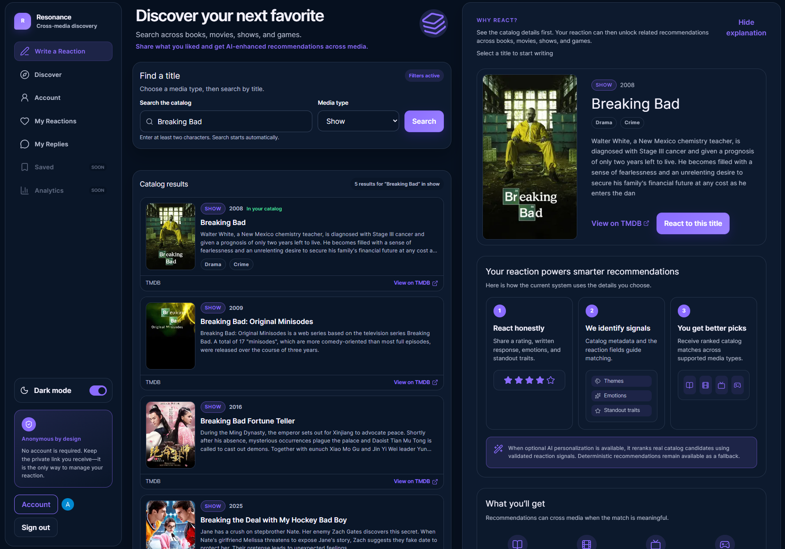
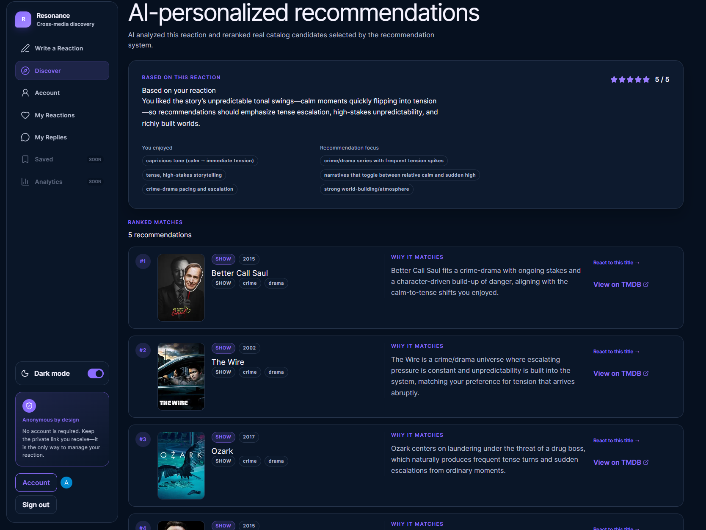
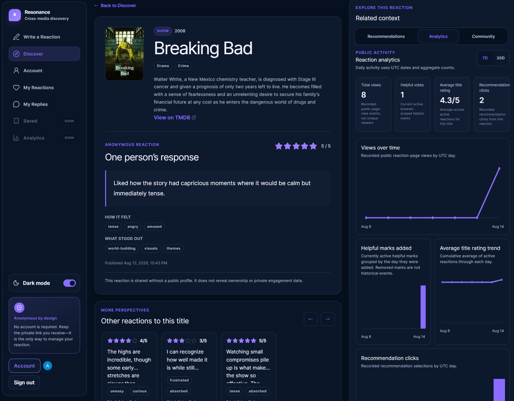
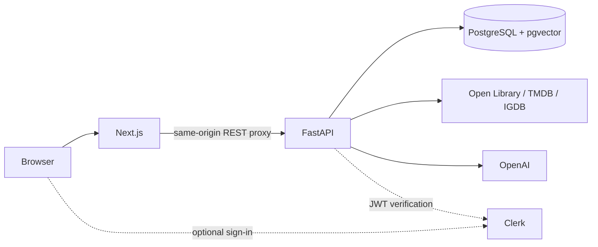

# Resonance

Resonance is a media discovery application where people can react
to books, movies, TV shows, and games, then receive recommendations across all
four media types.

**Live Demo:** [resonance.alanluu.net](https://resonance.alanluu.net)

**Source:** Private repository

This repository contains the public project overview and architecture
documentation. The application source is maintained in a private repository.

---

## Screenshots

### Search and react



_Search across multiple media catalogs, select a title, and describe what
stood out._

### Cross-media recommendations



_Recommendations can connect books, movies, shows, and games through shared
themes and reaction context._

### Public reaction page



_A public reaction includes recommendations, related reactions, community
replies, and aggregate analytics._

---

## Why I Built It

Most recommendation systems rely heavily on ratings, viewing history, or title
similarity. Those signals show what someone consumed, but not necessarily why
it worked for them.

Resonance also captures written reactions, ratings, emotion tags,
and standout attributes. That context helps retrieve and rank titles that share
the qualities the person cared about, even when the recommendation is a
different media type.

## Architecture



The Next.js App Router frontend sends REST requests through a same-origin proxy
to FastAPI. FastAPI owns validation, catalog normalization, reaction workflows,
authentication checks, analytics, embeddings, and recommendation orchestration.

PostgreSQL is the system of record. pgvector stores content and reaction
embeddings beside relational catalog data, which allows semantic search and
metadata filtering in the same database. Open Library supplies books, TMDB
supplies movies and shows, and IGDB supplies games. Clerk sign-in and OpenAI
reranking are optional; anonymous reactions and deterministic recommendations
remain available without them.

## How Recommendations Work

```text
Reaction context
      ↓
Reaction embedding
      ↓
pgvector semantic candidates
  + structured metadata candidates
  + exploration candidates
      ↓
Hybrid scoring
      ↓
Creator and franchise diversity
      ↓
Deterministic recommendations
      ↓
Optional bounded OpenAI reranking
      ↓
Persisted final recommendations
```

### 1. Reaction context

The semantic input combines the source title's catalog metadata with the
user's rating, written reaction, emotion tags, and standout attributes. Input
text is deterministic, versioned, and hashed so stale embeddings can be found.

### 2. Candidate retrieval

pgvector cosine search retrieves semantic neighbors across media types. The
backend unions those rows with structured metadata matches and a controlled
exploration set, then excludes the source, low-quality records, non-primary
works, and canonical duplicates.

### 3. Hybrid ranking

Candidates receive a normalized score from several signals:

| Signal | Current weight |
| --- | ---: |
| Semantic similarity | 55% |
| Structured relevance | 20% |
| Media affinity | 10% |
| Catalog quality | 10% |
| Provider confidence and popularity | 5% |

Structured relevance includes theme, genre, reaction-attribute, creator,
lexical, and provider-relationship evidence. Cross-media candidates need
stronger semantic evidence than same-media candidates.

### 4. Diversity

A deterministic post-scoring pass discourages repeated creators and
franchises. It preserves relevance while preventing a recommendation list from
becoming a sequence of near-duplicate sequels or works by one author.

### 5. Optional AI reranking

OpenAI receives at most 15 already-approved candidates rather than searching
the full catalog. Request-local keys hide database UUIDs, output is structured
and validated, and activation rechecks the input version before replacing the
active result set.

Daily, monthly, and per-reaction limits bound paid usage. Matching successful
runs can be reused. If AI is disabled, unavailable, over budget, or returns an
invalid result, the deterministic recommendations remain active.

## Key Features

- Search across books, movies, TV shows, and games
- Reaction-based personalization using ratings, text, emotions, and attributes
- Cross-media semantic recommendations with pgvector
- Deterministic ranking, quality filtering, deduplication, and fallback
- Optional, validated OpenAI reranking with recommendation explanations
- Anonymous reactions with private management links
- Optional Google sign-in through Clerk
- Account-owned reactions and signed-in community replies
- Public reaction pages, related reactions, helpful voting, and analytics
- Resumable catalog synchronization and versioned embedding maintenance

## Tech Stack

| Area | Technologies |
| --- | --- |
| Frontend | Next.js 16, React 19, TypeScript, Tailwind CSS |
| Backend | FastAPI, Python 3.14, SQLAlchemy 2, Pydantic, Alembic |
| Database | PostgreSQL 18, pgvector 0.8, HNSW cosine search |
| Embeddings and AI | OpenAI embeddings and optional Responses API reranking |
| Catalog providers | Open Library, TMDB, IGDB; retained RAWG compatibility |
| Authentication | Clerk with Google sign-in |
| Infrastructure | Docker, Docker Compose, Caddy, DigitalOcean |
| Testing | pytest, mypy, Ruff, Vitest, Playwright |

## Engineering Highlights

### Hybrid recommendation pipeline

Semantic similarity is combined with structured metadata and exploration
candidates before ranking. Thresholds and media buckets allow cross-media
discovery without adding weak results simply to fill a list.

### Canonical multi-provider catalog

Open Library, TMDB, IGDB, and retained RAWG records are normalized into one
internal content model. Stable provider identities, quality checks, and
conservative title/year matching prevent duplicate imports without blindly
merging remakes or adaptations.

### PostgreSQL and pgvector

Vectors live beside the relational catalog instead of in a second database.
Filtered HNSW queries use transaction-local iterative scanning so content-type
filters can still return the requested semantic depth.

### Versioned embeddings

Catalog and reaction embeddings store their model configuration, input version,
and input hash. Interactive imports are maintained after commit, while bulk
catalog changes are handled by separate restartable backfills.

### AI with deterministic fallback

The model can reorder only an application-controlled shortlist. Candidate-key
schemas, output validation, input-version checks, and activation safeguards
keep probabilistic output outside the core correctness boundary.

### Cost and concurrency controls

Database advisory locks serialize budget and input-sensitive work. Daily,
monthly, and per-reaction limits, cost reservations, bounded retries, and
successful-run reuse prevent automatic reranking from becoming unbounded.

### Resumable catalog synchronization

Catalog jobs use provider checkpoints, bounded pages and transactions,
qualification rules, idempotent upserts, and retry categories. External HTTP
requests are kept outside long database write transactions.

## Example Recommendation Flow

A user reacts to a science-fiction title and says they especially liked:

- political intrigue
- detailed world-building
- morally complex characters

The reaction context is embedded and compared with catalog embeddings across
all four media types. Structured signals, catalog quality, and diversity rules
then refine the result. A final set might include:

- **BOOK:** another novel with political and social themes
- **SHOW:** a political science-fiction series
- **GAME:** a narrative-heavy science-fiction game
- **MOVIE:** a film centered on similar moral conflicts

The point is not to convert one title directly into another format. It is to
find related experiences across media based on the reaction's signals.

## Design Decisions

| Decision | Reason |
| --- | --- |
| PostgreSQL + pgvector | Relational filters and vector search stay in one consistency boundary. |
| Local canonical catalog | Existing reactions and recommendations do not depend entirely on live provider APIs. |
| Deterministic-first ranking | Recommendations remain available without a paid or successful AI call. |
| Persisted, versioned embeddings | Unchanged inputs are skipped and vectors are not regenerated for every request. |
| Bounded AI reranking | The model cannot select arbitrary catalog items, and cost remains controlled. |

## Deployment

```text
Internet → Caddy / HTTPS → Next.js container → FastAPI container
                                             → PostgreSQL + pgvector
```

The live application runs on DigitalOcean. Docker Compose defines the Next.js,
FastAPI, and PostgreSQL/pgvector services; Caddy provides the public HTTPS entry
point. The production edge configuration and source repository are not part of
this public showcase repository.

## What I Learned

- How to combine semantic retrieval with structured ranking instead of treating
  embeddings as the whole recommendation algorithm
- How to make AI an optional enhancement with validation, budgets, reuse, and a
  deterministic recovery path
- How to normalize and deduplicate data from providers with different identity
  and metadata conventions
- How to manage embeddings as persisted, versioned derived data
- How to balance nearest-neighbor relevance with creator and franchise diversity

## Future Improvements

- Add recommendation feedback such as save, not interested, and explanation
  usefulness
- Build an explicit user taste profile with clear privacy controls
- Expand the offline recommendation evaluation set and tune ranking from
  measured outcomes
- Improve normalized theme, franchise, creator, and alias metadata
- Move embedding and synchronization work to durable background workers as
  operational scale grows
- Explore richer recommendation explanations without weakening deterministic
  eligibility and fallback behavior

## Repository Note

This repository is the public portfolio page for Resonance. The
production application source is maintained in a private repository.
